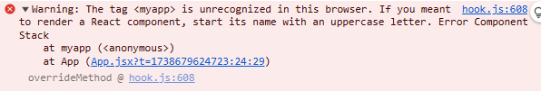
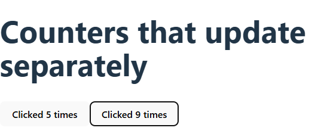
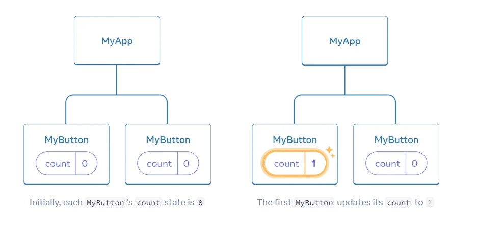
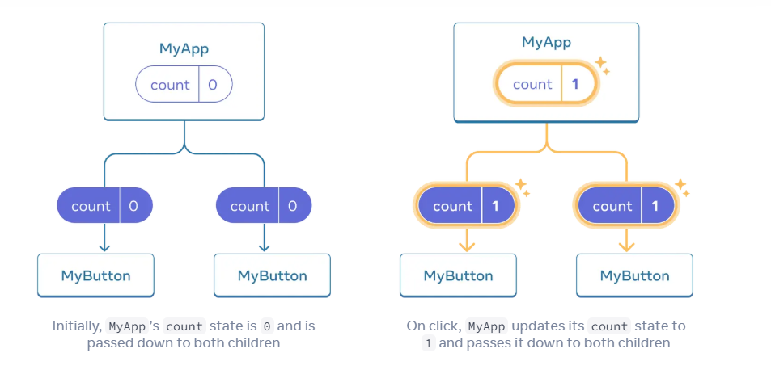

# React Docs notes

```react
Note: Phrases like `some text` or any sentence within backticks are important to remember and learn in the future
``` 

## Quick start 
- https://react.dev/learn
- always start component name with capital letter ex: (MyApp) not (myApp)


- jsx is optional
- in jsx, always close tags
- component can't return multiple jsx tags, wrap into parent

## Tool

- convert html to jsx
- https://transform.tools/html-to-jsx

- className not class
- escape into javascript from JSX using {} (curly braces)
- style={{}} is not special syntax but {} for escape into JS and {} is regular object 

```react
let content;
if (isLoggedIn) {
  content = <AdminPanel />;
} else {
  content = <LoginForm />;
}
return (
  <div>
    {content}
  </div>
);
```

- more compact code

```react
<div>
  {isLoggedIn ? (
    <AdminPanel />
  ) : (
    <LoginForm />
  )}
</div>
```

- don't need else then use logical &&

```react
<div>
  {isLoggedIn && <AdminPanel />}
</div>
```

- always pass key in map
- don't pass index

### Why?

- React uses a process called `reconciliation` to efficiently update the DOM when your app's state changes. Instead of re-rendering everything from scratch, React tries to figure out what exactly changed—like which items were added, removed, or reordered in a list.

- React can skip re-rendering items that haven't changed, improving performance.
- `have to revise why not to pass index`

- never call event handler function, just pass reference, react will call when user clicks

```react
<button onClick={handleClick}>
      Click me
</button>
```

- want component to remember some info use useState
```react
const [count, setCount] = useState(0);
```

- two things from useState: the current state (count), and the function that lets you update it (setCount).
- we can give any name but the convention is to write [something, setSomething]

```react
function MyButton() {
  const [count, setCount] = useState(0);

  function handleClick() {
    setCount(count + 1);
  }

  return (
    <button onClick={handleClick}>
      Clicked {count} times
    </button>
  );
}l̥
```

- `If you render the same component multiple times, each will get its own state.`

```react
import { useState } from 'react';

export default function MyApp() {
  return (
    <div>
      <h1>Counters that update separately</h1>
      <MyButton />
      <MyButton />
    </div>
  );
}

function MyButton() {
  const [count, setCount] = useState(0);

  function handleClick() {
    setCount(count + 1);
  }

  return (
    <button onClick={handleClick}>
      Clicked {count} times
    </button>
  );
}

```
- two independent instances of MyButton.
- each button "remembers" its own count state and does't affect other buttons.



- `learn about fibre tree`
- React maintains a structure called the Fiber Tree. Each component in the tree has its own "memory box" where React stores information like:

  - State (useState)
  - Effects (useEffect)
  - Context, refs, etc.

- `learn about why Order of Hooks Matters`

- Functions starting with "use" are called Hooks.
- Hooks are more restrictive than other functions. You can only call Hooks at the top of your components
- `If you want to use useState in a condition or a loop, extract a new component and put it there`.

## Scenario of state

- each MyButton had its own independent count, and when each button was clicked, only the count for the button clicked changed:


- what if you'll need components to share data and always update together.

To make both MyButton components display the same count and update together, you need to move the state from the individual buttons "upwards" to the closest component containing all of them.



```react
export default function MyApp() {
  const [count, setCount] = useState(0);

  function handleClick() {
    setCount(count + 1);
  }

  return (
    <div>
      <h1>Counters that update together</h1>
      <MyButton count={count} onClick={handleClick} />
      <MyButton count={count} onClick={handleClick} />
    </div>
  );
}
```

- The information pass down like this is called props

```react
function MyButton({ count, onClick }) {
  return (
    <button onClick={onClick}>
      Clicked {count} times
    </button>
  );
}
```

- This is called "ifting state up". By moving state up, you've shared it between components.

